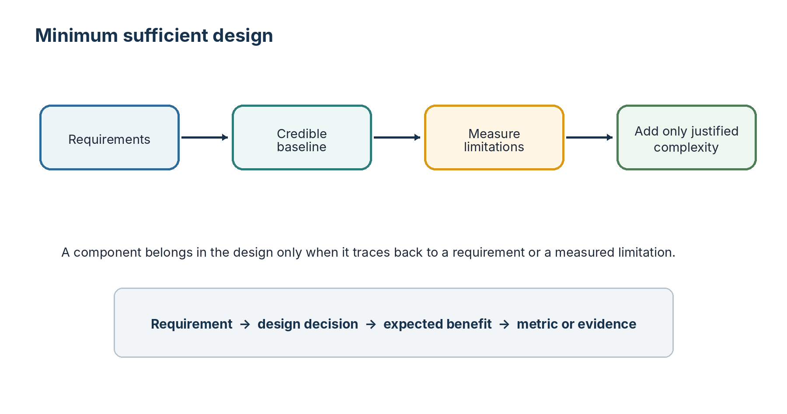
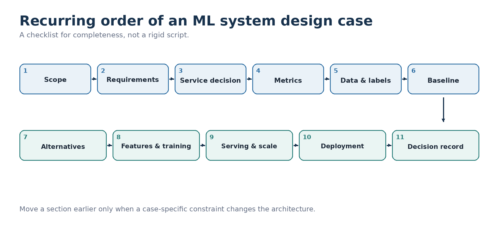
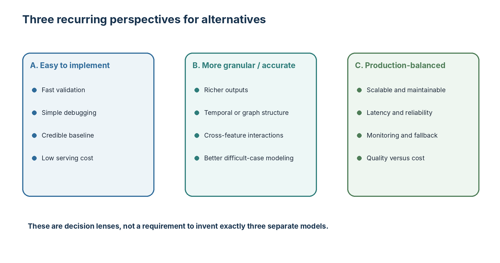
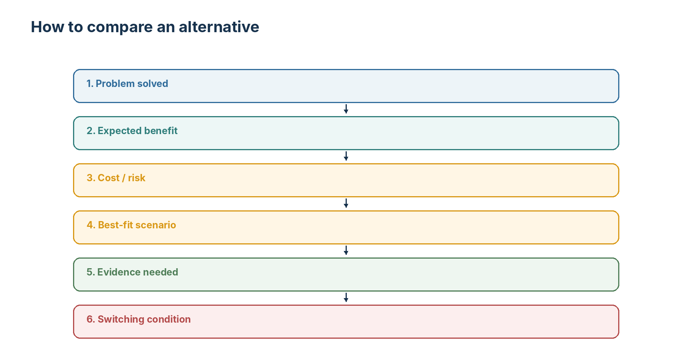
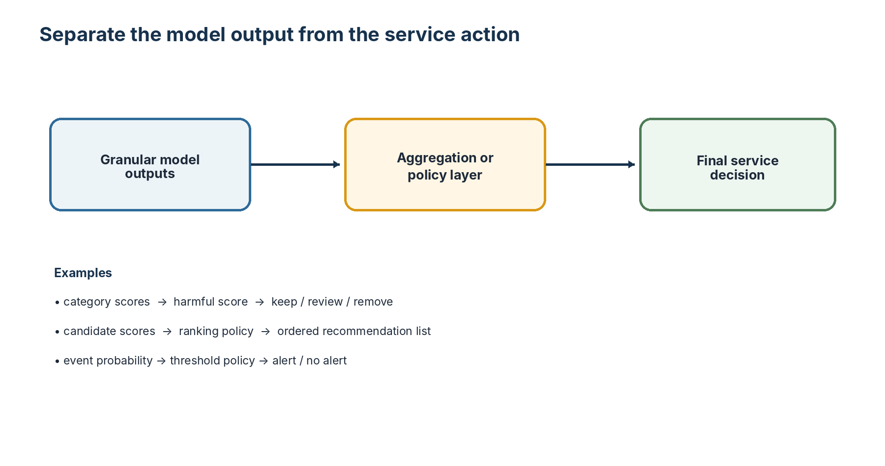
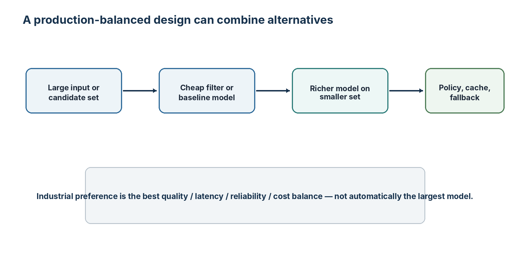
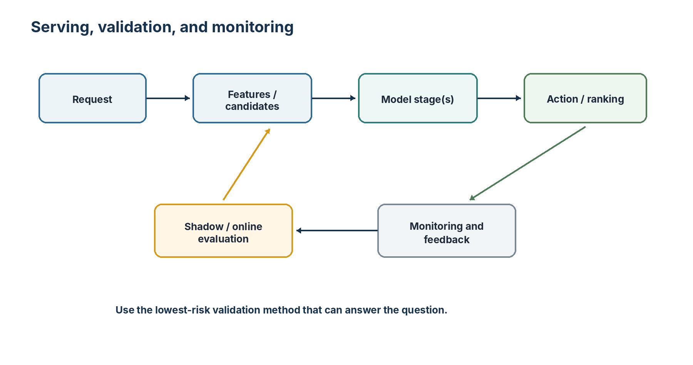

# Chapter 0: How to Approach an ML System Design Case

> **Primary reference:** This chapter began as personal study notes based largely on *Machine Learning System Design Interview* by Ali Aminian and Alex Xu. The restructuring, clarifications, comparison framework, diagrams, and interpretations are the author's own.

## Core principle

Choose the smallest architecture that can satisfy the current requirements. Add complexity only when it solves a demonstrated product, quality, latency, scale, or operational limitation.

## Recurring design order

1. Scope and objective
2. Requirements
3. Service-level decision
4. Product and offline metrics
5. Data and labels
6. Easy-to-implement baseline
7. Richer alternatives
8. Features and training
9. Serving and scale
10. Deployment and monitoring
11. Final decision record

## Alternative perspectives

### Easy to implement
A credible baseline for fast validation, debugging, and low-cost serving.

### More granular or accurate
A richer option that solves a specific limitation such as missing temporal, graph, multimodal, or task-specific structure.

### Production-balanced
The design that best balances quality, latency, scale, reliability, cost, and maintainability. It is not automatically the most complex model.

## Comparison rule

For each option, state:

1. the problem it solves;
2. the expected benefit;
3. the cost or risk;
4. the best-fit scenario;
5. the evidence needed;
6. the condition that would change the decision.

## Model output versus service action

Separate granular internal predictions from the final product action through an aggregation or policy layer.

## Production design

Simple and rich alternatives can be combined into stages: cheap filtering, richer scoring on a smaller set, and a production policy with caching, monitoring, and fallback.

## Serving and deployment

Choose fully online, precomputed, or hybrid serving according to freshness and latency. Add scaling methods only after identifying the bottleneck. Choose shadow deployment, interleaving, or A/B testing according to product risk and the question being measured.

## Final interview statement

> I would begin with the smallest system that satisfies the core requirements, establish a measurable baseline, and add complexity only when a specific product, quality, latency, or scaling limitation justifies it.

## Attribution

This project is not affiliated with the book's authors or publisher and is not a substitute for the original book. Public chapters use original wording and diagrams and do not include handwritten source scans.
