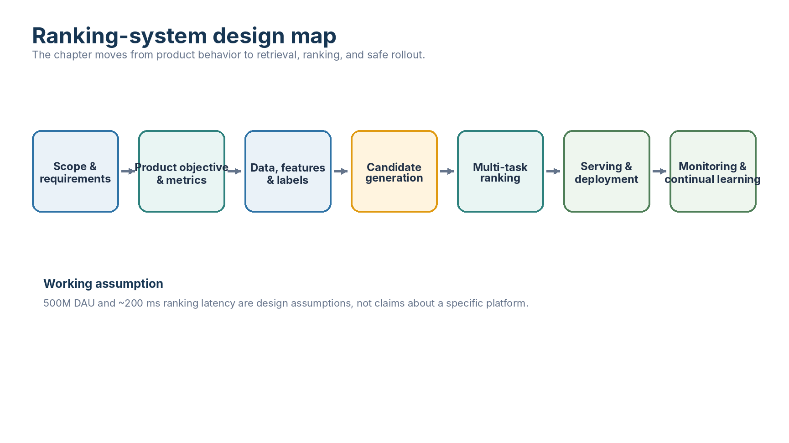
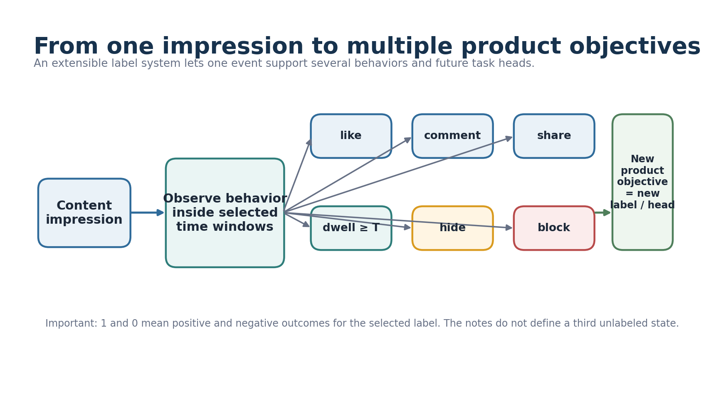
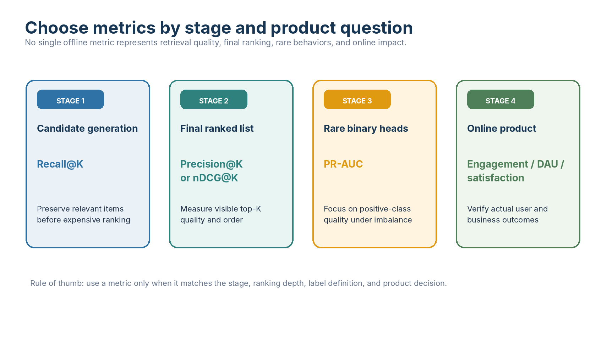
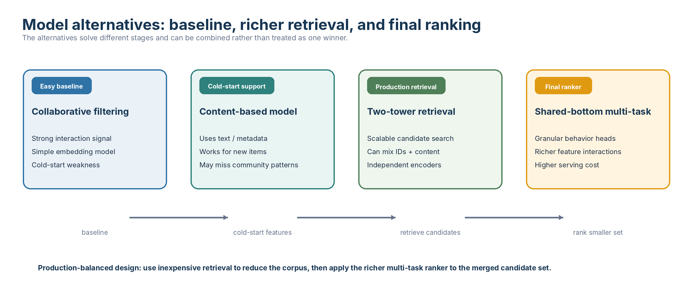
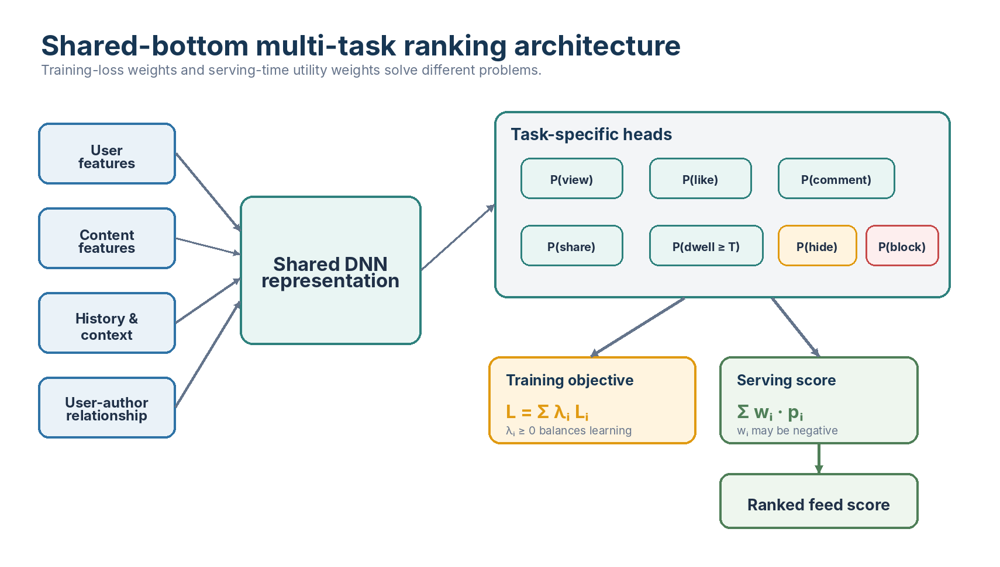
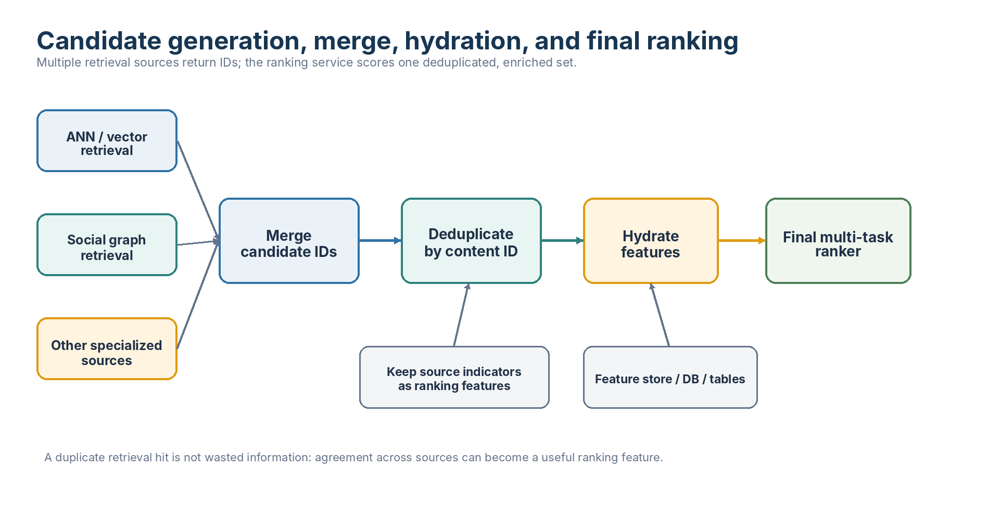
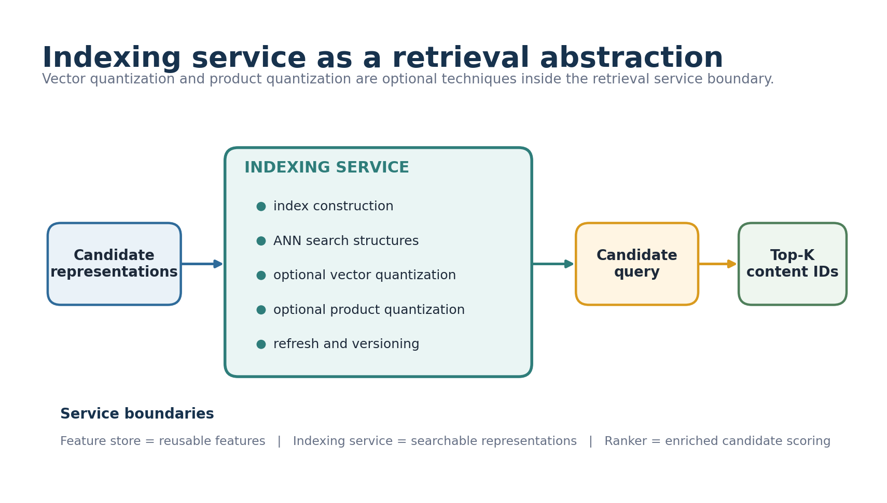
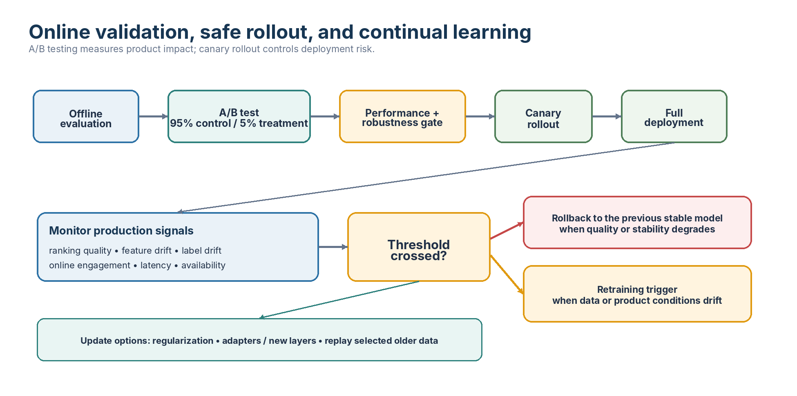
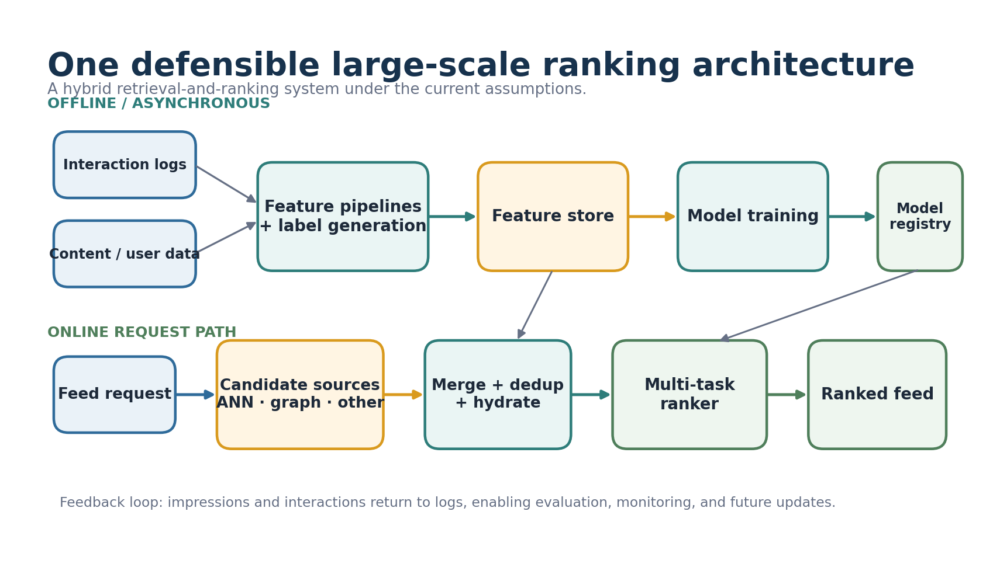

# Chapter 1: Designing a Large-Scale Social Feed Ranking System

> **Primary reference:** This chapter began as personal study notes based largely on *Machine Learning System Design Interview* by Ali Aminian and Alex Xu. The restructuring, clarifications, trade-off discussions, diagrams, and interpretations are the author's own.

## Core design

Build a hybrid retrieval-and-ranking system that predicts several user behaviors, combines them into a serving score, and ranks a manageable candidate set under large-scale latency constraints.

## 1. Scope and requirements

**Input:** a user requesting a social feed.  
**Output:** a ranked list of posts.  
**Service objective:** improve useful engagement and user experience while meeting latency, availability, monitoring, and rollout requirements.

Working assumptions:

- approximately 500 million daily active users;
- approximately 200 ms for the ranking request;
- high availability, debugging, analytics, and MLOps support;
- advertising monetization remains out of scope.

These values force scale reasoning and are not claims about a specific company.

## 2. Product objective and extensible labels

One impression may produce several labels: like, comment, share, dwell above a threshold, hide, block, or interaction within a selected window.

This makes the label system extensible: a new product objective can become a new label and, in the multi-task model, a new prediction head.

**Confirmed interpretation:** `1` and `0` mean positive and negative outcomes for the selected label. The notes do not define a third unlabeled state.

## 3. Metrics by stage

Use different metrics for different decisions.

| Stage | Useful metrics | Main question |
|---|---|---|
| Candidate generation | Recall@K | Did retrieval preserve relevant items? |
| Final ranking | Precision@K, mAP, MRR, nDCG@K | Is the visible ordering useful? |
| Rare binary heads | PR-AUC, precision, recall | Does the model identify rare positive behavior? |
| Broad score discrimination | ROC-AUC | Does the score separate classes across thresholds? |
| Online product | Engagement, satisfaction, DAU | Does the system improve actual product outcomes? |

Ordinary Recall@K may look small when the number of historical positives is much larger than K. That does not make the metric incorrect; it may simply answer a different question than visible top-K quality.

## 4. Model alternatives

The main model families solve different stages and can be combined.

### Collaborative filtering

A credible easy-to-implement baseline using user-item interaction structure. Its central weakness is cold start.

### Content-based modeling

Uses content and user attributes, helping when interaction history is sparse.

### Two-tower retrieval

Independently encodes users and content for scalable similarity search. With only user-ID and item-ID embeddings, it becomes close to matrix-factorization collaborative filtering. With text, metadata, context, and history, it becomes a richer hybrid retrieval model.

### Shared-bottom multi-task ranking

The preferred final ranker. Shared layers learn a common representation, while smaller heads predict behaviors such as views, likes, comments, shares, dwell thresholds, hides, and blocks.

The handwritten MoE annotation is preserved as a personal comparison question. The drawn architecture is a shared-bottom multi-task network, not a gated Mixture of Experts.

## 5. Multi-task architecture and score construction

User-author relationship signals are input features, not a separate output head or post-hoc score. They may include friendship status, duration, family or neighbor indicators, relationship strength, mutual connections, and prior interaction frequency.

Training and serving use different weights:

- `lambda_i` weights task losses during learning and should remain nonnegative;
- `w_i` expresses serving-time utility and may be negative for undesirable outcomes such as hide or block.

These values should not be copied mechanically from one another.

## 6. Data, features, and freshness

Core entities include users, posts, interactions, and relationship records.

| Feature category | Examples | Freshness question |
|---|---|---|
| User | ID, location, language, history | Which fields must update online? |
| Content | text, image, video, topic, author | Which embeddings can be precomputed? |
| Interaction | impressions, likes, comments, dwell | Which windows are used for labels? |
| Relationship | friendship, duration, mutual links | How frequently does the graph change? |
| Context | time, device, request context | Is it available at ranking time? |

An aggregated feature summarizes multiple events. A delayed feature becomes available after asynchronous processing. One feature can be both aggregated and delayed.

## 7. Training design

For task `i`, the combined loss is:

`L_total = sum_i lambda_i * L_i`

Choosing `lambda_i` remains an open design question. Consider business importance, label frequency, loss magnitude, task difficulty, gradient interference, per-task validation, and final ranking quality.

The exact dwell threshold and interaction windows are also product decisions rather than fixed constants.

## 8. Candidate generation and final ranking

The final ranker should not score the entire corpus.

Candidate sources may include ANN/vector retrieval, social-graph retrieval, and other specialized services. Their IDs are merged, deduplicated, enriched with features, and ranked together.

Retrieval-source signals should be preserved. An item found by both ANN and the social graph may deserve a feature indicating that agreement.

## 9. Indexing service

The indexing service builds and maintains searchable representations for candidate generation. Vector quantization and product quantization are optional techniques inside this service; they are not separate ranking objectives.

Service boundary:

- feature store: reusable model features;
- indexing service: searchable representations;
- candidate-generation service: index queries;
- ranking service: enriched candidate scoring.

## 10. Online validation and deployment

The 5% treatment and 95% control split is an A/B test. It measures online product impact. After performance and robustness are demonstrated, a canary rollout expands exposure gradually to control deployment risk.

A/B testing and canary rollout answer different questions:

- A/B testing: does the new system improve the product metric?
- canary rollout: can the new system operate safely at increasing production scale?

Rollback remains available at every staged rollout step.

## 11. Monitoring and continual learning

Monitor ranking quality, feature drift, label drift, online engagement, latency, and availability.

When updates are needed, the notes consider regularization, adapters or new trainable layers, and replaying some older data. Older-data replay may reduce forgetting but distort the time distribution, so it remains a trade-off.

## 12. Reference architecture

**Starting recommendation:** use a hybrid architecture. Precompute reusable content representations and indexes, retrieve candidates from several sources, merge and hydrate them, and apply a shared-bottom multi-task ranker online.

## Decision summary

| Design area | Starting choice | Switch when |
|---|---|---|
| Objective | Multi-behavior prediction | One scalar target is demonstrably sufficient |
| Retrieval | Two-tower / ANN plus graph sources | A simpler source meets coverage and latency |
| Final model | Shared-bottom multi-task DNN | Shared or single-task baseline performs similarly |
| Labels | Extensible Boolean outcomes | Product requires continuous or graded targets |
| Metrics | Stage-specific suite | One metric is proven to represent all key decisions |
| Indexing | ANN abstraction with optional VQ/PQ | Exact search fits scale and latency |
| Validation | A/B test, then canary | Product risk requires a different rollout plan |
| Updating | Monitor, retrain when triggered | Stable behavior makes periodic updates sufficient |

## Open discussion prompts

- How should multi-task loss weights be selected?
- When would an MoE-style architecture outperform shared-bottom?
- Which features require real-time freshness?
- How should candidate-source budgets be allocated?
- Which offline metrics should gate online experimentation?
- What drift or quality rule should trigger retraining?

## Attribution

This project is independent study work and is not affiliated with the book's authors or publisher. It is not a substitute for the original book. Public versions use original wording and original diagrams and exclude handwritten source scans.
