# Chapter 2: Predicting Ad Clicks on a Social Media Platform

> **Primary reference:** This chapter began as personal study notes based largely on *Machine Learning System Design Interview* by Ali Aminian and Alex Xu. The restructuring, clarifications, trade-off discussions, diagrams, and interpretations are the author's own.

## Core design

Predict calibrated click probability for eligible ads, apply explicit repeated-exposure and hide/block guardrails, and use a two-stage retrieval-and-ranking architecture when inventory scale requires it.

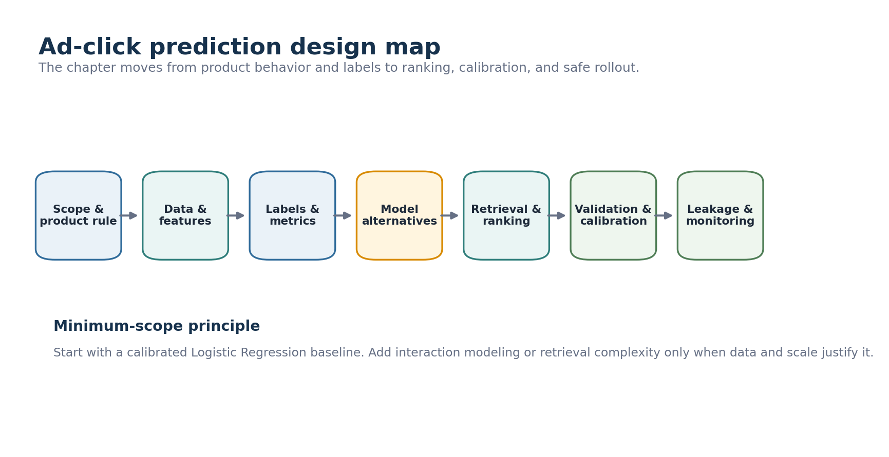

## 1. Scope and product policy

The service predicts `P(click)` for eligible ads. The score supports ranking and revenue decisions, while serving policy separately controls frequency, fatigue, hide, and block behavior.

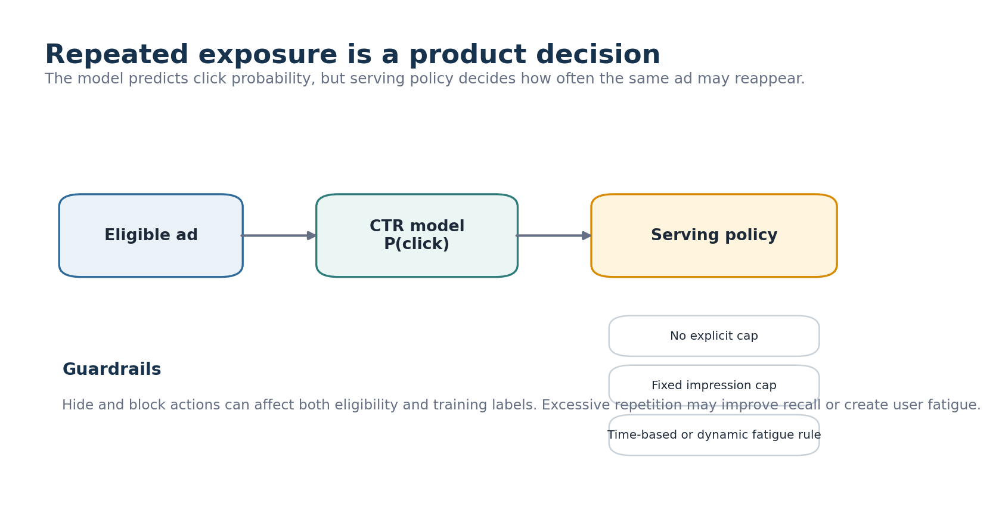

## 2. Data and labels

Feature families include ad and campaign attributes, user and context features, historical engagement, and impression-level interactions.

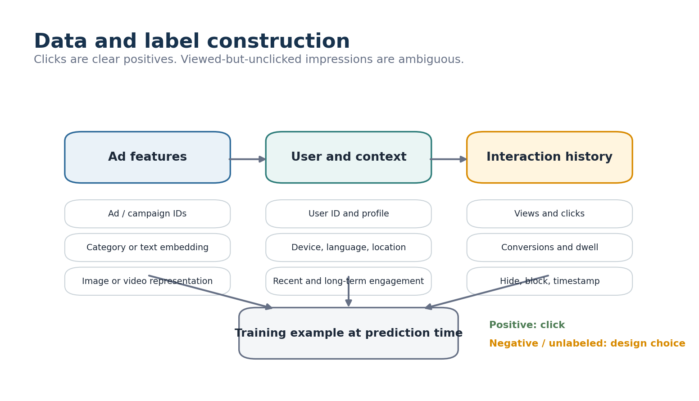

A click is a clear positive. A viewed-but-unclicked impression may be treated as a negative, left unlabeled, or assigned confidence through weighting or PU-style learning. Start with a transparent baseline and add complexity only when hidden positives materially limit performance.

## 3. Metrics

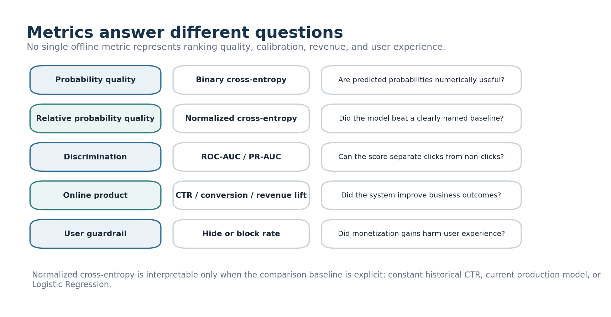

Use binary cross-entropy for probability quality, normalized cross-entropy relative to a named baseline, ROC-AUC or PR-AUC for discrimination, and online CTR, conversion, revenue lift, and hide rate for product validation.

## 4. Model alternatives

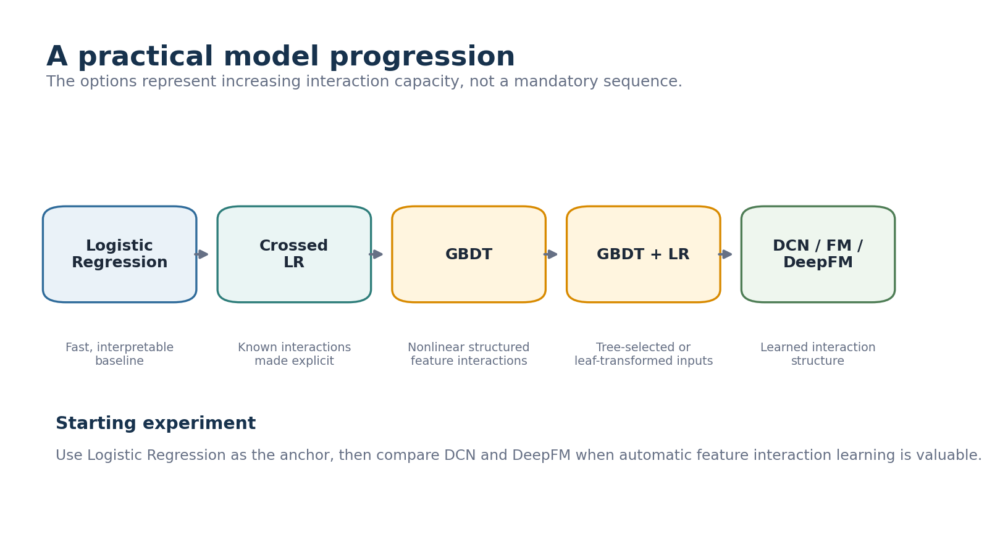

| Approach | Main benefit | Main cost |
|---|---|---|
| Logistic Regression | Fast, interpretable baseline | Manual interactions |
| Feature crossing + LR | Explicit known interactions | Sparse feature explosion |
| GBDT | Nonlinear structured interactions | Awkward sparse IDs and updates |
| GBDT + LR | Tree-selected or leaf-transformed representation | Two-stage complexity |
| DCN | Explicit and deep crosses | More training and serving complexity |
| FM | Efficient pairwise interactions | Limited interaction order |
| DeepFM / xDeepFM | Low-order plus complex interactions | Higher latency and tuning cost |

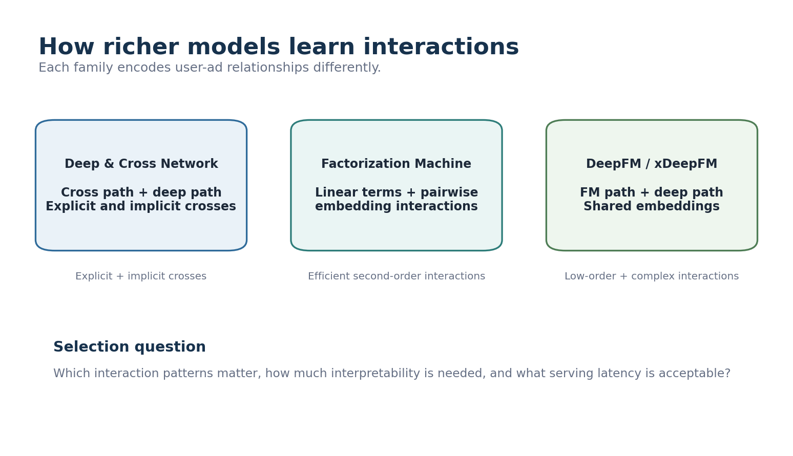

The experimental direction in the notes is to keep Logistic Regression as the anchor and compare DCN and DeepFM.

## 5. Retrieval and ranking

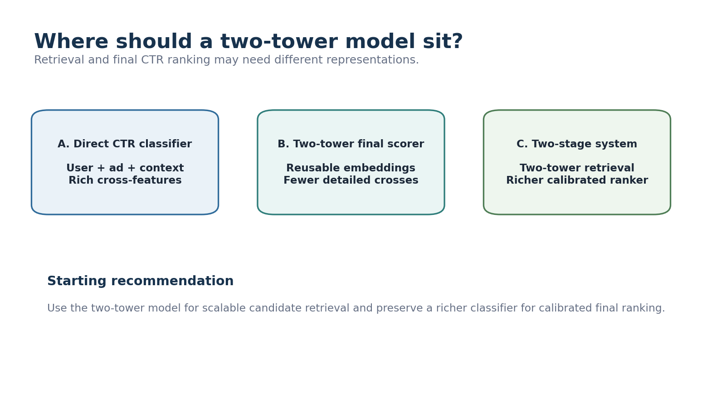

At large inventory scale, use the two-tower model for candidate retrieval rather than forcing it to be the final CTR scorer. Merge candidate sources, deduplicate, retrieve features, and apply a richer calibrated classifier.

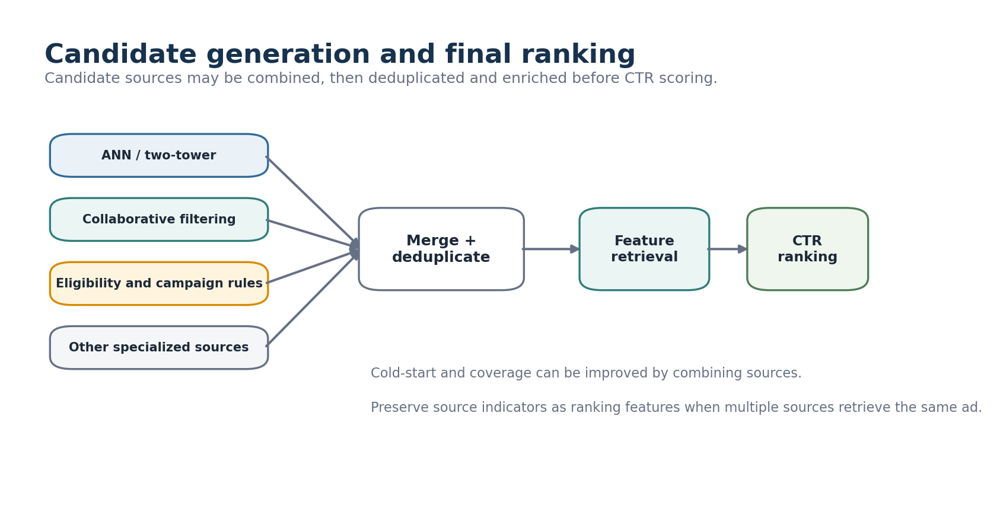

## 6. Continual learning

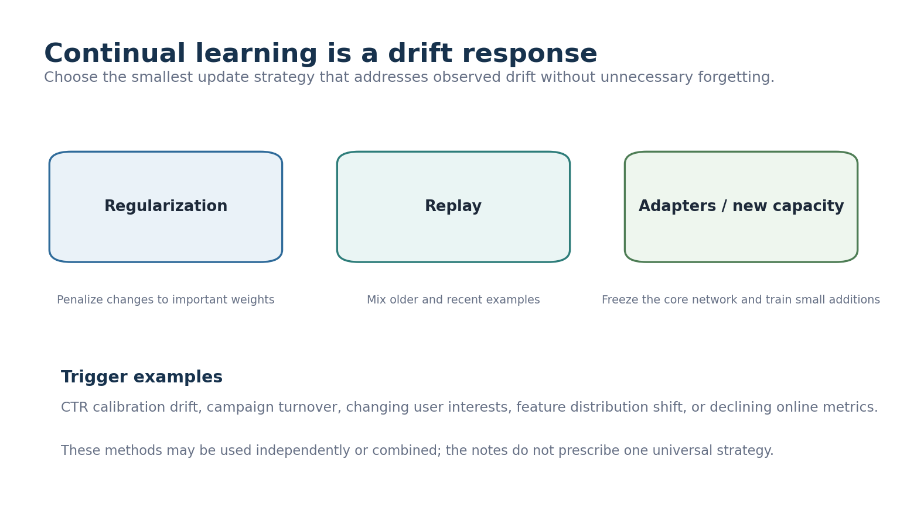

Regularization, replay, and adapters or progressive capacity are alternatives. Select them in response to measured drift or forgetting rather than adding all methods by default.

## 7. Production validation and calibration

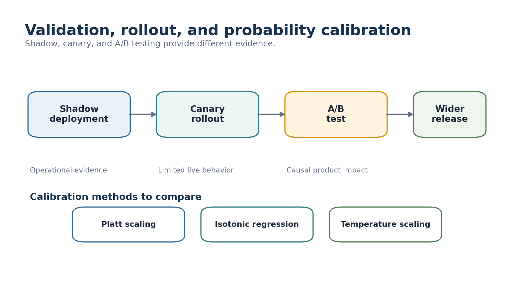

Shadow deployment validates operational behavior. Canary rollout provides limited live feedback. A/B testing measures causal product impact. Platt scaling, isotonic regression, and temperature scaling remain calibration alternatives.

## 8. Leakage prevention

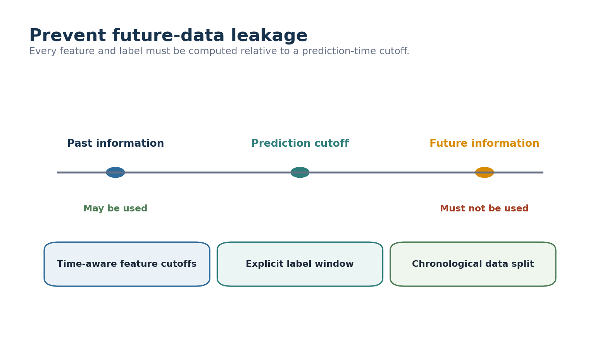

Use point-in-time features, an explicit label window, and chronological train, validation, and test splits.

## 9. Reference architecture

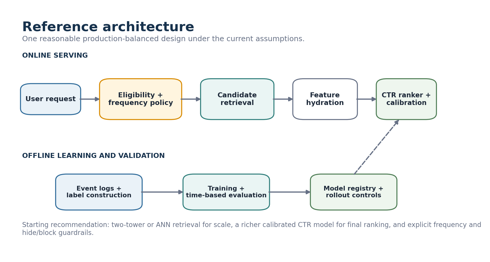

**Starting recommendation:** apply eligibility and frequency policy, retrieve candidates with two-tower or ANN and complementary sources, merge and hydrate features, score with a richer CTR model, calibrate probabilities, and deploy through staged validation.

## Decision summary

| Design area | Starting choice | Switch when |
|---|---|---|
| Exposure | Explicit frequency or fatigue policy | Dynamic behavior is demonstrably needed |
| Negative labels | Transparent impression-based baseline | Hidden positives limit quality |
| Baseline | Logistic Regression | A simpler prior is sufficient |
| Richer model | Compare DCN and DeepFM | Lift does not justify complexity |
| Two-tower | Candidate retrieval | Inventory is small or cross-feature loss is too high |
| Final score | Calibrated richer CTR model | Similarity score performs equivalently |
| Updating | Monitor and retrain when triggered | Stable behavior supports periodic updates |
| Rollout | Shadow, limited live traffic, A/B test | Risk profile requires another sequence |
| Leakage | Point-in-time features and chronological splits | Never optional |

## Attribution

This project is independent study work and is not affiliated with the book's authors or publisher. It is not a substitute for the original book. Public versions use original wording and original diagrams and exclude handwritten source scans.
