# Chapter 3: People You May Know

> **Primary reference:** This chapter began as personal study notes based largely on *Machine Learning System Design Interview* by Ali Aminian and Alex Xu. The restructuring, clarifications, trade-off discussions, diagrams, and interpretations are the author's own.

## Core design

Generate a bounded pool of plausible non-connected users, score future connection relevance with a simple supervised baseline first, cache recommendations with lazy refresh, and promote a temporal GNN only when temporal memory produces measurable incremental value.

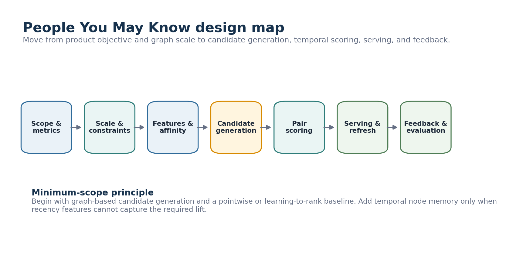

## 1. Scope and scale

The task predicts future social edges but serves a short ranked list. The capacity assumptions in the notes are illustrative rather than verified platform facts.

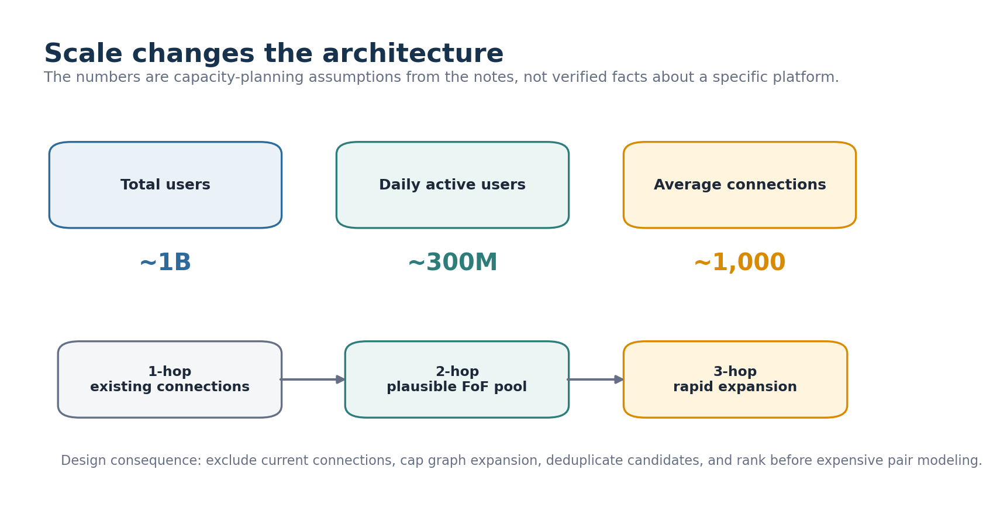

## 2. Metrics

Requests sent and received measure activity. Accepted or completed connections better represent mutual value. Use PR-AUC and top-K metrics offline, then validate connection outcomes and safety guardrails online.

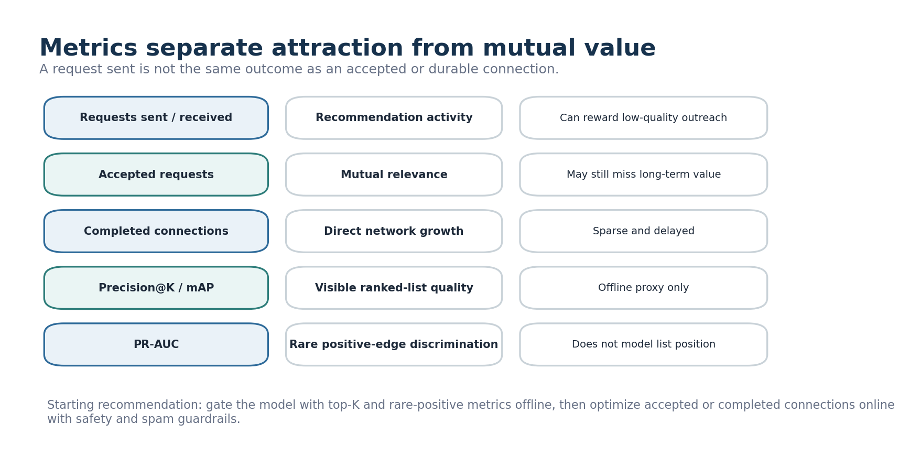

## 3. Model alternatives

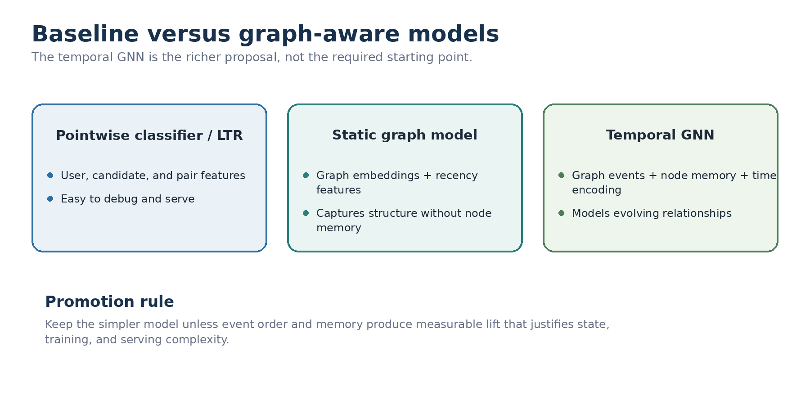

| Direction | Main benefit | Main cost |
|---|---|---|
| Pointwise classifier / LTR | Simple training and serving | Manual graph summaries |
| Static graph model + recency | Captures topology without temporal state | Loses event order |
| Temporal GNN | Models evolving relationships | State and operational complexity |

## 4. Features and temporal affinity

Combine profile, pair, graph, direct activity, recency, and exposure features. Mutual count alone is not enough.

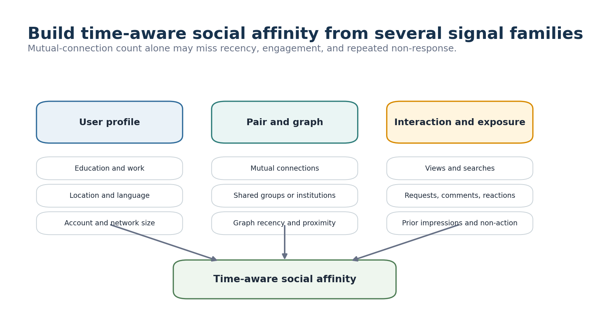

## 5. Temporal GNN

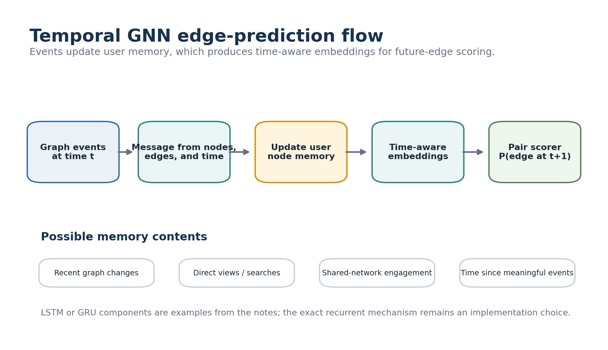

Graph events produce messages that update user memory and create time-aware embeddings for future-edge scoring. LSTM or GRU components are illustrative choices from the notes, not fixed requirements.

## 6. Candidate generation

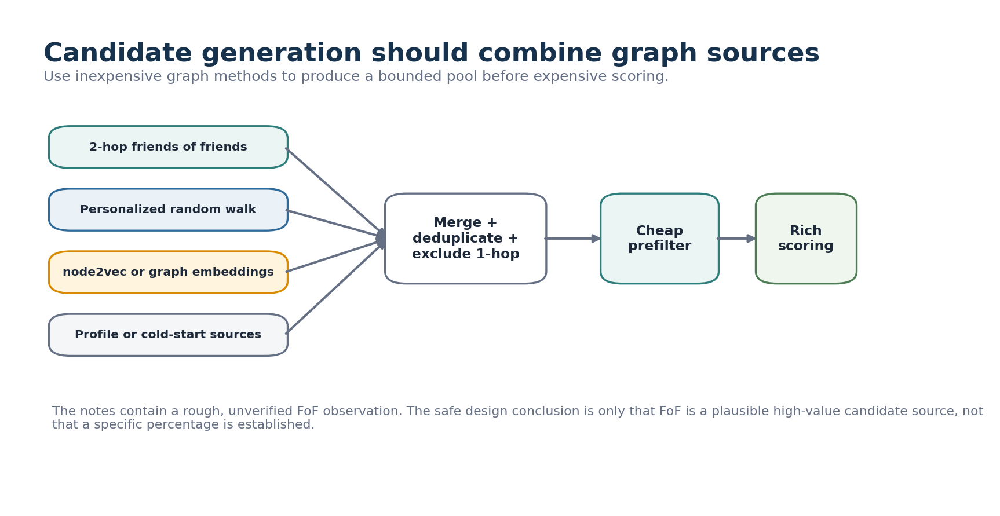

Use bounded friends-of-friends, personalized random walk, graph embeddings, and profile-based cold-start sources as alternatives or complementary sources. The rough FoF percentage in the notes is not presented as verified fact.

## 7. Pair scoring

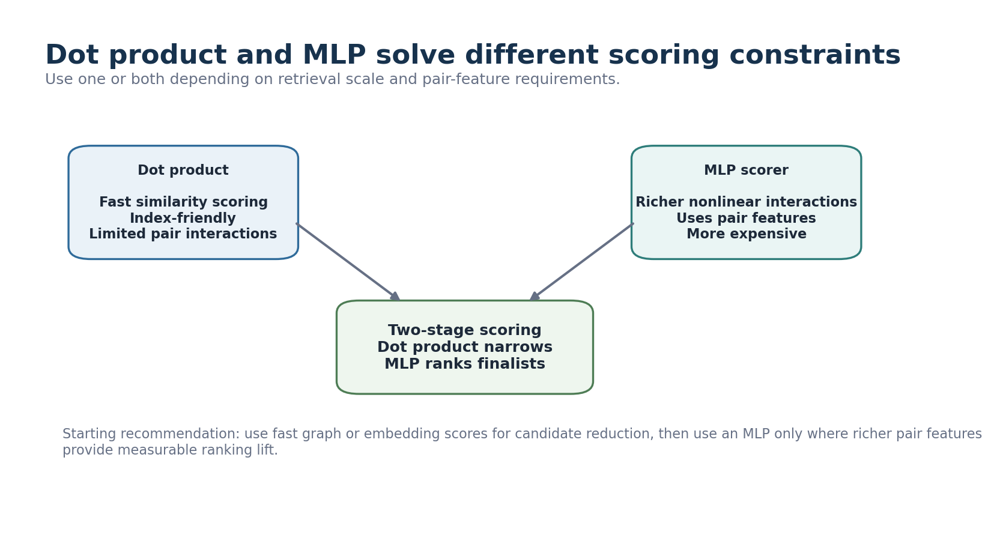

Use dot product or another cheap graph score for narrowing and an MLP for rich finalist ranking when pair-feature lift justifies the cost.

## 8. Serving and refresh

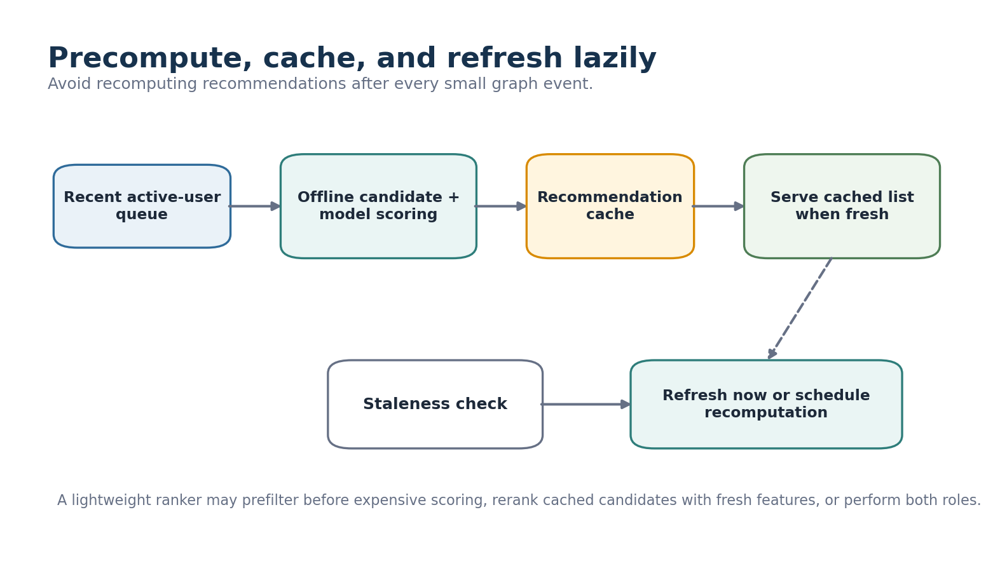

Precompute for likely active users, serve cached results when fresh, and refresh lazily when stale. A lightweight ranker may prefilter, rerank cached candidates with fresh features, or do both.

## 9. Missing profiles, exposure, and delayed feedback

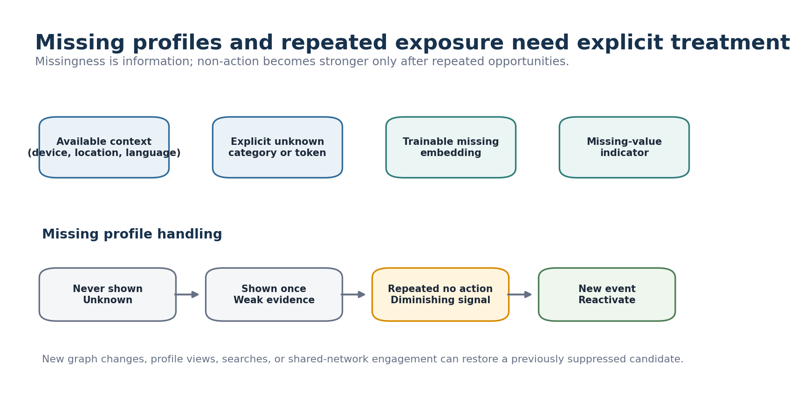

Represent missing profile values explicitly. Treat one ignored recommendation as weak evidence, repeated exposure without action as a diminishing signal, and new graph or engagement events as possible reactivation.

## 10. Negative pairs and online evaluation

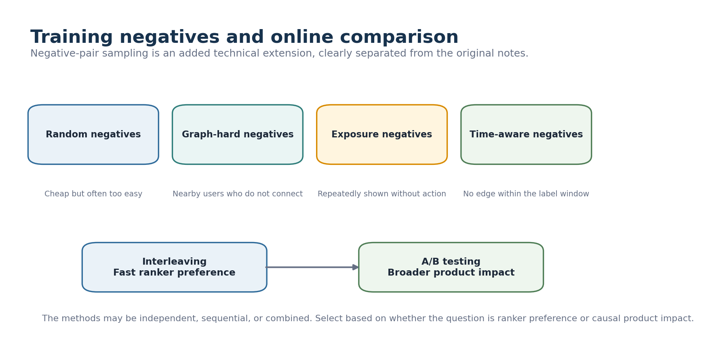

Negative-pair sampling is an added technical extension. Random, graph-hard, exposure-based, and time-aware negatives each carry different bias. Interleaving and A/B testing may be independent, sequential, or combined.

## 11. Reference architecture

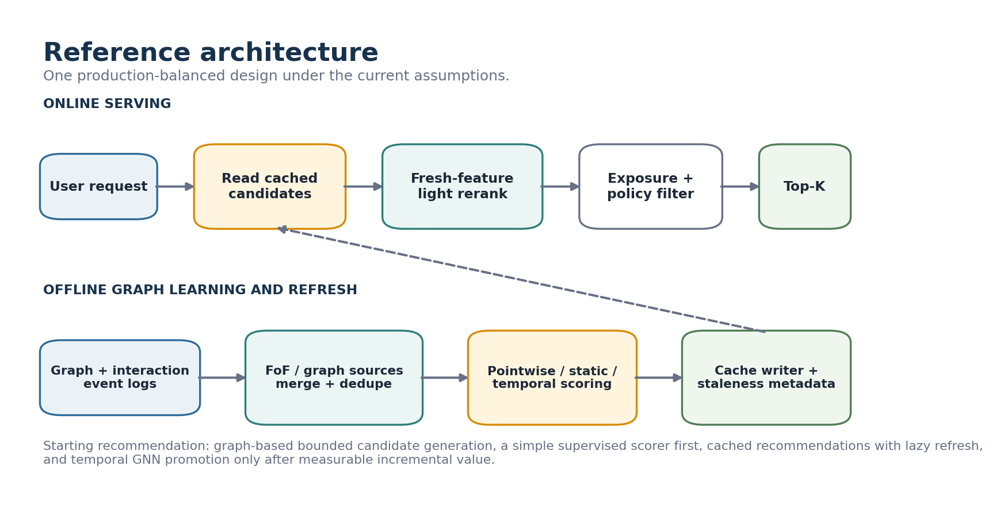

**Starting recommendation:** bounded graph candidate generation, a pointwise or static model first, cached serving with lazy refresh, lightweight fresh reranking, and temporal GNN promotion only after measurable incremental value.

## Decision summary

| Design area | Starting choice | Switch when |
|---|---|---|
| Product outcome | Accepted or completed connections | Request volume is proven sufficient |
| Candidate source | Bounded 2-hop FoF plus complementary sources | Coverage requires broader traversal |
| Baseline | Pointwise classifier or LTR | Static graph modeling adds clear value |
| Richer model | Temporal GNN experiment | Temporal lift does not justify state cost |
| Pair scoring | Cheap narrowing then MLP finalists | One scorer satisfies scale and quality |
| Serving | Precompute, cache, lazy refresh | Freshness loss harms outcomes |
| Ignored items | Gradual penalty and temporary suppression | Non-action is non-informative |
| Evaluation | Top-K and PR-AUC, then online test | Offline metrics fail to predict product impact |

## Attribution

This project is independent study work and is not affiliated with the book's authors or publisher. It is not a substitute for the original book. Public versions use original wording and original diagrams and exclude handwritten source scans.
