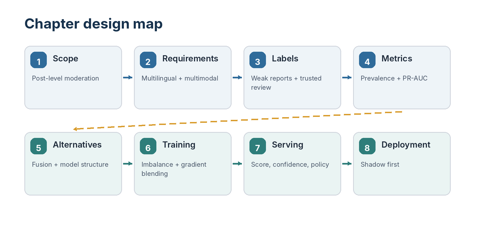
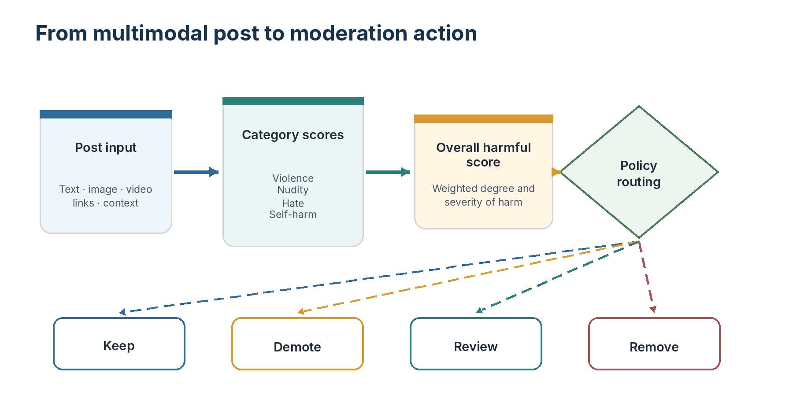
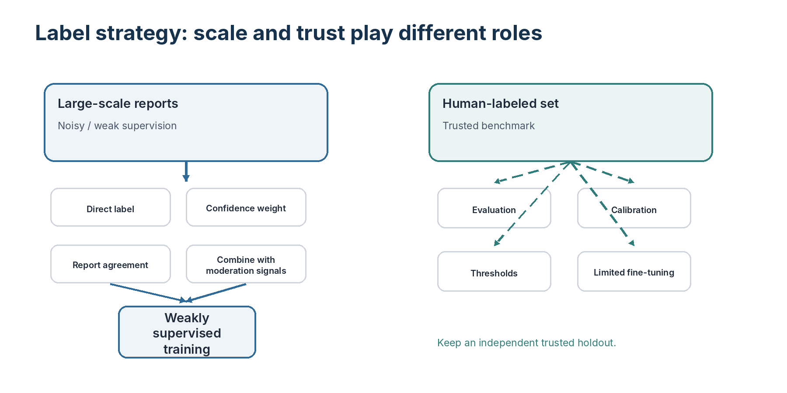
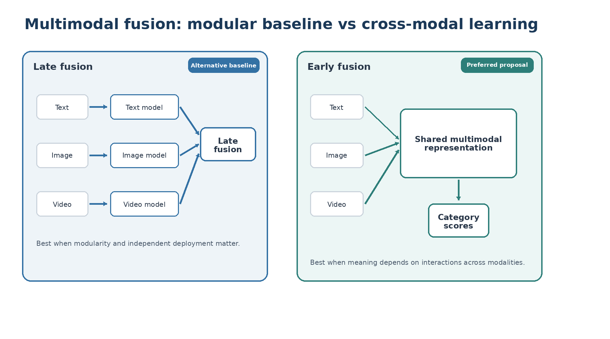
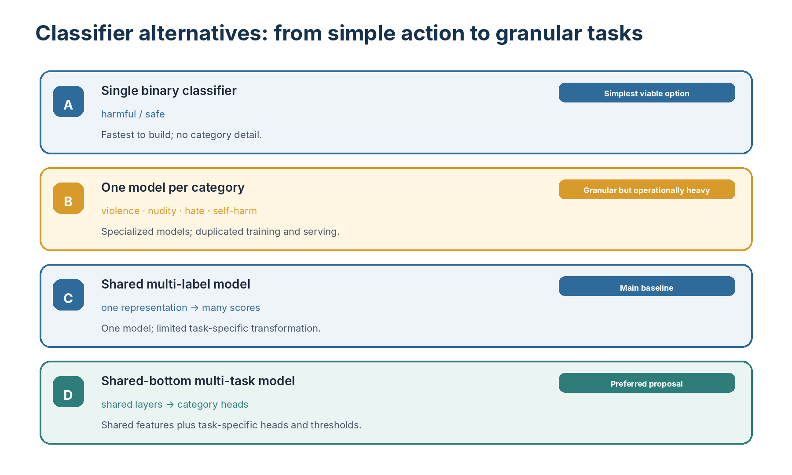
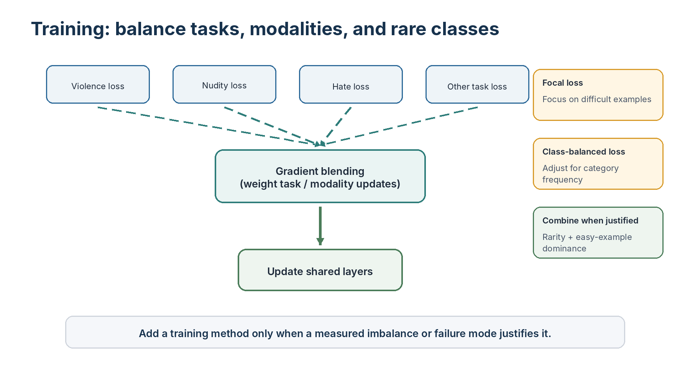
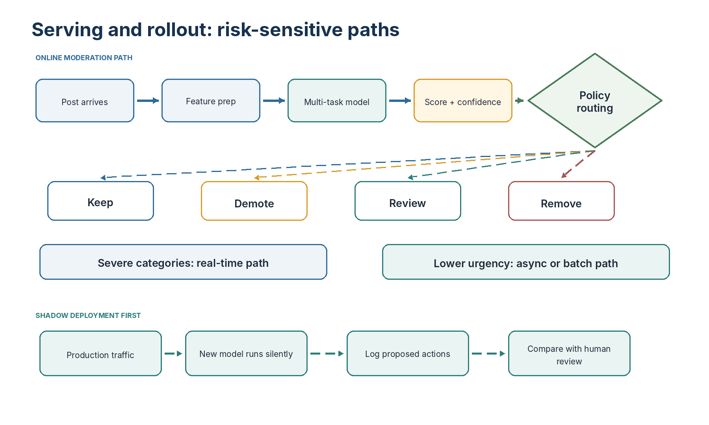
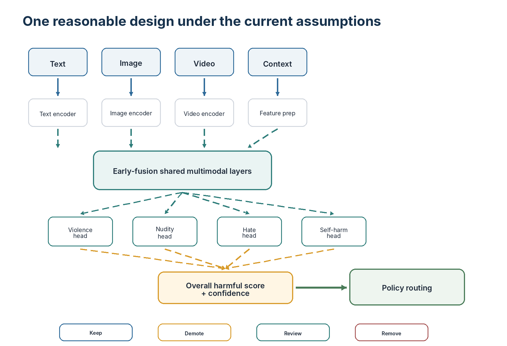

*A multimodal moderation system-design case study*

## About this chapter

> **Primary reference:** This chapter began as personal study notes based largely on *Machine Learning System Design Interview* by Ali Aminian and Alex Xu. The restructuring, clarifications, trade-off discussions, diagrams, and interpretations are the author's own.

This chapter preserves the design process in the original notes while organizing it into an interview- and discussion-ready system-design case.

The main focus is **post-level harmful-content detection and moderation**:

```text
Multimodal post
        |
        v
Category-level harm scores
        |
        v
Overall harmful score
        |
        v
Keep / demote / review / remove
```

The chapter keeps the main alternatives from the notes open for comparison. It does not expand into unrelated modeling methods.

Bad-actor detection is briefly mentioned as a separate system that aggregates behavior over time. User-facing explanation generation is also handled by a separate downstream service.

---

## Visual chapter map






## 1. Problem definition

The service receives a post that may contain:

- text;
- images;
- video;
- links;
- post context;
- selected author and engagement features.

The system predicts multiple harm categories, such as:

- violence;
- nudity;
- hate;
- self-harm;
- other harmful categories.

These category scores are combined into an overall harmful score used by a moderation policy.

```text
Text + image + video + context
                |
                v
       Harmful-content model
                |
                v
[violence, nudity, hate, self-harm, ...]
                |
                v
        Overall harmful score
                |
                v
        Moderation decision
```

### Related but separate systems

#### Bad-actor detection

A separate system can aggregate posts, reports, violations, and behavior over time:

```text
Posts + reports + violations + behavior
                    |
                    v
             Actor-level risk
```

This case does not develop the actor-level architecture in detail.

#### Misinformation

Misinformation can follow a similar system-design process, but its labeling and policy boundaries are more complex. It remains outside the detailed scope.

---

## 2. Requirements

### Functional requirements

The system should:

- support multiple languages;
- process text, images, video, and multimodal combinations;
- output category-level harm scores;
- produce an overall harmful score;
- support moderation actions such as keep, demote, review, or remove;
- provide structured reason codes for a separate explanation service.

### Latency requirements

Latency depends on severity.

```text
Urgent / severe category
        -> real-time prediction

Lower-urgency category
        -> asynchronous or batch prediction may be acceptable
```

Violence is the main example in the notes of a category that may require immediate detection.

### Out of scope

- user-facing explanation generation;
- detailed bad-actor architecture;
- detailed misinformation architecture.

> **Open design discussion - Latency**
>
> **Which categories require real-time detection?**  
> ______________________________________________
>
> **Which categories may use asynchronous detection?**  
> ______________________________________________
>
> **What model-cost trade-off is acceptable?**  
> ______________________________________________

---

## 3. Labels and training data




### Large-scale weak supervision

User reports provide scalable but noisy labels.

Possible treatments from the clarification discussion include:

- use reports directly;
- weight them by confidence;
- require agreement across reports;
- combine reports with moderation or behavioral signals.

A report is not automatically a perfect ground-truth label.

### Trusted human-labeled data

A smaller human-labeled dataset is used primarily for:

- evaluation;
- calibration;
- threshold selection.

It may also support limited fine-tuning when enough high-quality examples exist, provided that the trusted benchmark remains independent.

```text
Large-scale reports
        |
        v
Weakly supervised training

Human-labeled data
        |
        +--> evaluation
        +--> calibration
        +--> threshold selection
        +--> optional limited fine-tuning
```

> **Open design discussion - Label strategy**
>
> **How should a single report affect the label?**  
> ______________________________________________
>
> **Should multiple reports increase confidence?**  
> ______________________________________________
>
> **Which reports should be filtered?**  
> ______________________________________________
>
> **How much human-labeled data should be reserved for evaluation?**  
> ______________________________________________

---

## 4. Product metrics

The notes contain several possible business metrics. Their exact definitions depend on the product objective.

### Content prevalence

```text
Harmful posts remaining visible
--------------------------------
Total posts
```

This measures harmful content volume.

### Exposure prevalence

```text
Harmful impressions
-------------------
Total impressions
```

This measures user exposure to harmful content.

### Valid appeal rate

```text
Reversed enforcement decisions
------------------------------
Appealed enforcement decisions
```

This measures the quality of moderation decisions among appealed cases.

### Proactive detection rate

```text
Confirmed harmful content detected before reports
-------------------------------------------------
All confirmed harmful content
```

This measures how much harmful content is found before users report it.

### Category-level monitoring

Reports and moderation outcomes should also be broken down by category to identify weak areas.

> **Open design discussion - Primary business metric**
>
> **Primary metric:**  
> ______________________________________________
>
> **Why this metric matches the product goal:**  
> ______________________________________________
>
> **Guardrail metrics:**  
> ______________________________________________
>
> **Category and severity breakdowns:**  
> ______________________________________________

---

## 5. Offline evaluation

The notes retain:

- precision;
- recall;
- PR-AUC;
- ROC-AUC.

### Why PR-AUC matters

Harmful content is rare. PR-AUC focuses more directly on positive-class performance and the trade-off between detecting harmful content and producing false positives.

### ROC-AUC caution

ROC-AUC can appear strong when true negatives are extremely numerous. It remains useful, but should not be the only metric.

### Threshold selection

Thresholds may differ by harmful category because the consequences of missing violence may differ from the consequences of incorrectly flagging another category.

> **Open design discussion - Offline evaluation**
>
> **Primary offline metric:**  
> ______________________________________________
>
> **Category-specific thresholds:**  
> ______________________________________________
>
> **Which false positive is most costly?**  
> ______________________________________________
>
> **Which false negative is most costly?**  
> ______________________________________________

---

## 6. Early fusion versus late fusion




The notes compare two multimodal architectures.

### Late fusion

```text
Text  -> Text model  --\
Image -> Image model ---+-> Fusion -> Harm scores
Video -> Video model --/
```

**Advantages**

- modular;
- easier to debug;
- each modality can use a specialized model;
- missing modalities may be easier to handle.

**Disadvantages**

- may combine information too late;
- may miss cross-modal meaning;
- requires maintaining multiple models.

### Early fusion

```text
Text + image + video representations
                |
                v
       Shared multimodal model
                |
                v
        Category harm scores
```

**Advantages**

- learns cross-modal relationships;
- supports one shared model;
- can capture meaning that depends on multiple modalities.

**Disadvantages**

- harder to train;
- missing modalities need careful representation;
- higher compute and engineering complexity.

### Preferred proposal

Early fusion is the preferred design in the notes. Late fusion remains the comparison baseline.

> **Open design discussion - Fusion**
>
> **Measured improvement required to justify early fusion:**  
> ______________________________________________
>
> **Missing-modality behavior:**  
> ______________________________________________
>
> **Latency and compute limit:**  
> ______________________________________________
>
> **Chosen fusion design:**  
> ______________________________________________

---

## 7. Architecture alternatives




The notes compare four classifier designs.

### Option 1 - Single binary classifier

Predict:

```text
harmful / safe
```

**Advantage:** simplest design.  
**Limitation:** does not explain which harmful category caused the decision.

### Option 2 - One binary classifier per category

```text
Violence model
Nudity model
Hate model
Self-harm model
```

**Advantage:** category-specific models.  
**Limitation:** multiple models increase training and serving cost.

### Option 3 - Shared multi-label classifier

```text
Shared representation
        |
        v
[violence, nudity, hate, self-harm, ...]
```

**Advantage:** one model with independent category outputs.  
**Limitation:** all categories depend heavily on the same final transformation.

### Option 4 - Shared-bottom multi-task classifier

```text
Shared multimodal layers
        /      |      \
       v       v       v
 Violence   Nudity   Hate / other
    head      head       heads
```

**Advantages**

- shared representation reduces duplication;
- category heads learn task-specific transformations;
- each category may use its own threshold and loss weight.

**Disadvantages**

- more complex than the shared multi-label baseline;
- task gradients may be imbalanced;
- head and loss-weight design require tuning.

### Preferred proposal

The shared-bottom multi-task model is the preferred design. The shared multi-label model remains the main simpler baseline.

> **Open design discussion - Model architecture**
>
> **Expected gain over the multi-label baseline:**  
> ______________________________________________
>
> **Which categories require more specialized heads?**  
> ______________________________________________
>
> **How large should each head be?**  
> ______________________________________________
>
> **What result would justify keeping the simpler baseline?**  
> ______________________________________________

---

## 8. Example modality encoders

The notes use specific examples to show the possible implementation level.

### Text

- DistilBERT;
- Sentence-BERT;
- multilingual sentence embeddings.

### Image

- CLIP visual encoder;
- SimCLR.

### Video

- VideoMoCo.

These are illustrative examples, not fixed requirements.

```text
Text encoder   -> text representation
Image encoder  -> image representation
Video encoder  -> video representation
                     |
                     v
                Early fusion
```

The encoder choice depends on language coverage, accuracy, latency, sequence length, and infrastructure.

---

## 9. Missing modalities

A post may contain:

- text only;
- image only;
- text and image;
- text and video;
- all modalities.

The notes keep several alternatives open.

### Zero representation

Use a zero vector for a missing modality.

**Pros:** simple.  
**Cons:** may be confused with a valid low-information representation.

### Special vector or token

Use an explicit missing-modality representation.

**Pros:** makes missingness visible to the model.  
**Cons:** adds a learned or engineered representation.

### Encoder-specific representation

Use another explicit method appropriate to the modality encoder.

Different modalities may use different approaches.

> **Open design discussion - Missing modalities**
>
> **Text missing representation:**  
> ______________________________________________
>
> **Image missing representation:**  
> ______________________________________________
>
> **Video missing representation:**  
> ______________________________________________
>
> **How the model distinguishes missing from neutral content:**  
> ______________________________________________

---

## 10. Additional features

### Engagement

Possible features include:

- number of impressions;
- likes;
- comments;
- shares;
- reports.

Only information available at prediction time should be used.

### Comments

The simple default is to average embeddings from a bounded number of available comments.

Minimal alternatives for discussion:

- attention-weighted pooling;
- top-k or max-risk pooling;
- thread-aware aggregation;
- exclude comments from initial moderation and use them only for later rescoring.

Comments may not exist when the post is first published, so they may be more useful for later rescoring.

> **Open design discussion - Comment use**
>
> **Initial moderation:**  
> ______________________________________________
>
> **Later rescoring:**  
> ______________________________________________
>
> **Default aggregation:**  
> ______________________________________________
>
> **When a more complex method is justified:**  
> ______________________________________________

### Author features

The notes include:

- prior reports or violations;
- profanity rate;
- follower and following counts;
- account information.

Only history available before the current post may be used.

Open choices:

- include author history in the harmful score;
- use it only for confidence or review routing;
- exclude it so the decision depends only on content.

The main trade-off is predictive value versus bias against previously flagged users.

> **Open design discussion - Author history**
>
> **Use in harmful score, review routing, or neither?**  
> ______________________________________________
>
> **Temporal leakage guardrail:**  
> ______________________________________________
>
> **Bias concern:**  
> ______________________________________________

### Context

Possible context features include:

- posting time;
- device;
- country or location;
- selected categorical indicators.

---

## 11. Category scores and overall harmful score

The internal model is multi-label. The service produces an overall harmful score for policy decisions.

```text
Violence score
Nudity score
Hate score
Self-harm score
Other category scores
        |
        v
Overall harmful score
```

Several categories may be present at different levels.

### Option 1 - Weighted combination

Severe categories can contribute more strongly.

**Pros:** clear and interpretable.  
**Cons:** weights require policy and validation decisions.

### Option 2 - Highest-risk category

Use the strongest category score.

**Pros:** simple and sensitive to one severe category.  
**Cons:** may ignore combinations of moderate categories.

### Option 3 - Learned aggregation

Learn the overall score from granular scores and selected context.

**Pros:** can capture category interactions.  
**Cons:** less transparent and requires suitable labels.

### Option 4 - Hybrid

Combine learned aggregation with explicit rules for severe categories.

**Pros:** balances flexibility and policy control.  
**Cons:** adds maintenance complexity.

> **Open design discussion - Harmful-score aggregation**
>
> **Chosen method:**  
> ______________________________________________
>
> **Which categories receive higher influence?**  
> ______________________________________________
>
> **Can multiple moderate scores trigger action?**  
> ______________________________________________
>
> **Which severe category can override the aggregate score?**  
> ______________________________________________

---

## 12. Training the multi-task model




Each category head has its own classification loss.

```text
Shared multimodal representation
        /       |       \
       v        v        v
Violence loss  Nudity loss  Hate / other losses
        \       |       /
         Gradient blending
                |
                v
        Update shared layers
```

### Gradient blending

Different tasks or modalities may produce gradients with different magnitudes.

The notes propose assigning or learning weights before combining them.

**Pros**

- reduces domination by one task or modality;
- preserves a shared model;
- allows important categories to receive more influence.

**Cons**

- weights require tuning or learning;
- over-balancing can weaken important signals;
- training and debugging become more complex.

> **Open design discussion - Gradient blending**
>
> **Primary imbalance: task, modality, or both?**  
> ______________________________________________
>
> **Fixed or learned weights?**  
> ______________________________________________
>
> **Which categories need more influence?**  
> ______________________________________________
>
> **Evidence that blending helps:**  
> ______________________________________________

---

## 13. Class imbalance

Harmful content is rare, and some harmful categories are much rarer than others.

The notes retain two methods.

### Focal loss

Reduces the contribution of easy examples and emphasizes difficult ones.

**Advantages**

- focuses learning on difficult harmful examples;
- reduces domination by easy safe examples.

**Risks**

- difficult examples may include noisy reports;
- the focusing parameter requires tuning.

### Class-balanced loss

Adjusts class influence using the number of examples.

**Advantages**

- directly addresses category-frequency imbalance;
- gives rare categories more influence.

**Risks**

- noisy rare categories may receive excessive weight;
- frequency alone does not measure difficulty.

### Combination

The two may be combined when there is a clear reason:

```text
Class-balanced weight
        x
Focal adjustment
        x
Classification loss
```

Class-balanced weighting addresses rarity. Focal adjustment addresses example difficulty.

> **Open design discussion - Imbalance**
>
> **Use focal loss, class-balanced loss, or both?**  
> ______________________________________________
>
> **Evidence for frequency imbalance:**  
> ______________________________________________
>
> **Evidence for easy-example dominance:**  
> ______________________________________________
>
> **How noisy reports affect the decision:**  
> ______________________________________________

---

## 14. Attention scaling

Standard attention has quadratic growth with sequence length:

```text
Standard attention: O(n²)
```

The notes suggest linear or approximate attention for long multimodal inputs:

```text
Long text / video / combined sequence
                |
                v
       Linear attention option
```

### Standard attention

**Pros:** full token-to-token interaction and simpler modeling.  
**Cons:** expensive for long sequences.

### Linear or approximate attention

**Pros:** lower compute and memory for long inputs.  
**Cons:** may lose some interaction quality.

This is an optional scaling technique, not a requirement for every input.

> **Open design discussion - Attention**
>
> **Sequence length where standard attention becomes a problem:**  
> ______________________________________________
>
> **Modalities causing the bottleneck:**  
> ______________________________________________
>
> **Measured quality loss allowed:**  
> ______________________________________________

---

## 15. Serving and moderation policy

The serving path uses category scores, overall harmful score, confidence, and category severity.

```text
Post features
        |
        v
Multi-task harmful-content model
        |
        v
Category scores + harmful score + confidence
        |
        +--> low risk       -> keep
        +--> moderate risk  -> demote or limit distribution
        +--> uncertain      -> manual review
        +--> high risk      -> remove and possibly record violation
```

Thresholds may differ by category.

Examples:

- high violence risk may require a lower removal threshold;
- uncertain borderline content may require manual review;
- moderate risk may justify demotion before removal.

The user-facing explanation is produced by another service. This model may pass structured category scores or reason codes downstream.

> **Open design discussion - Action routing**
>
> **Keep threshold:**  
> ______________________________________________
>
> **Demotion range:**  
> ______________________________________________
>
> **Manual-review condition:**  
> ______________________________________________
>
> **Removal threshold:**  
> ______________________________________________
>
> **Category-specific overrides:**  
> ______________________________________________

---

## 16. Shadow deployment




A/B testing can be risky when model errors directly affect harmful-content exposure or incorrect removal.

The preferred first production-validation step is shadow deployment.

```text
Production traffic
        |
        v
New model runs silently
        |
        v
Scores and proposed actions are logged
        |
        v
Compare with current system and human review
        |
        v
Limited enforcement after validation
```

Shadow deployment can validate:

- latency;
- reliability;
- score distribution;
- agreement with the current system;
- disagreement cases;
- human-review quality;
- category-level performance.

It cannot fully measure user behavior after real moderation actions because the model is not yet enforcing decisions.

A/B testing may be considered later for lower-risk changes.

> **Open design discussion - Deployment**
>
> **Shadow metrics:**  
> ______________________________________________
>
> **Required agreement with human review:**  
> ______________________________________________
>
> **Disagreement cases to inspect:**  
> ______________________________________________
>
> **Exit criteria for limited enforcement:**  
> ______________________________________________

---

## 17. End-to-end design




```text
Post text / image / video / context
                    |
                    v
        Modality-specific encoders
                    |
                    v
             Early fusion
                    |
                    v
       Shared multimodal layers
       /        |        |       \
      v         v        v        v
 Violence   Nudity     Hate    Self-harm
   score      score     score      score
       \        |        |       /
        \       |        |      /
         Overall harmful score
                    |
                    v
       Confidence and policy layer
                    |
      +-------------+-------------+
      |             |             |
     keep        review        remove
                    |
                  demote
```

### Related actor-level system

```text
Posts + reports + violations + behavior over time
                        |
                        v
               Actor-level risk score
```

The actor-level system is separate from the post-removal service.

---

## 18. Decision worksheet

### Scope

**Main harmful categories:**  
______________________________________________

**Real-time categories:**  
______________________________________________

### Labels

**Treatment of user reports:**  
______________________________________________

**Use of human labels:**  
______________________________________________

### Metrics

**Primary product metric:**  
______________________________________________

**Primary offline metric:**  
______________________________________________

### Fusion

**Early or late fusion:**  
______________________________________________

**Reason:**  
______________________________________________

### Architecture

**Multi-label baseline or multi-task model:**  
______________________________________________

**Expected improvement required:**  
______________________________________________

### Harmful score

**Aggregation method:**  
______________________________________________

**Category overrides:**  
______________________________________________

### Training

**Gradient-blending strategy:**  
______________________________________________

**Focal, class-balanced, or both:**  
______________________________________________

### Features

**Missing-modality method:**  
______________________________________________

**Comment use:**  
______________________________________________

**Author-history use:**  
______________________________________________

### Serving

**Keep / demote / review / remove policy:**  
______________________________________________

### Deployment

**Shadow-deployment exit criteria:**  
______________________________________________

---

## 19. Main lessons

1. The service can be multi-label internally while supporting a single overall harmful score.
2. Category scores support analysis, severity weighting, thresholding, and downstream reason codes.
3. User reports provide scale but should be treated as noisy supervision.
4. Human labels are most valuable as a trusted benchmark for evaluation and calibration.
5. Early fusion is useful when harmful meaning depends on cross-modal interactions.
6. A shared-bottom multi-task model balances feature sharing and category-specific learning.
7. Gradient blending helps prevent one task or modality from dominating shared layers.
8. Focal loss and class-balanced loss address different aspects of imbalance and may be combined for a demonstrated reason.
9. Missing modalities must be represented explicitly.
10. Comments and author history should be used carefully because of timing, leakage, and bias.
11. The overall harmful score should reflect both category degree and category severity.
12. Moderation is a policy spectrum: keep, demote, review, or remove.
13. Linear attention is an optional scaling method for long sequences.
14. Shadow deployment is a safer first production step than immediate enforcement.
15. Bad-actor detection is a related but separate actor-level system.

---

```{=openxml}
<w:p><w:r><w:br w:type="page"/></w:r></w:p>
```

# Appendix A - Original handwritten notes

The original notes are preserved as the authoritative visual source.
